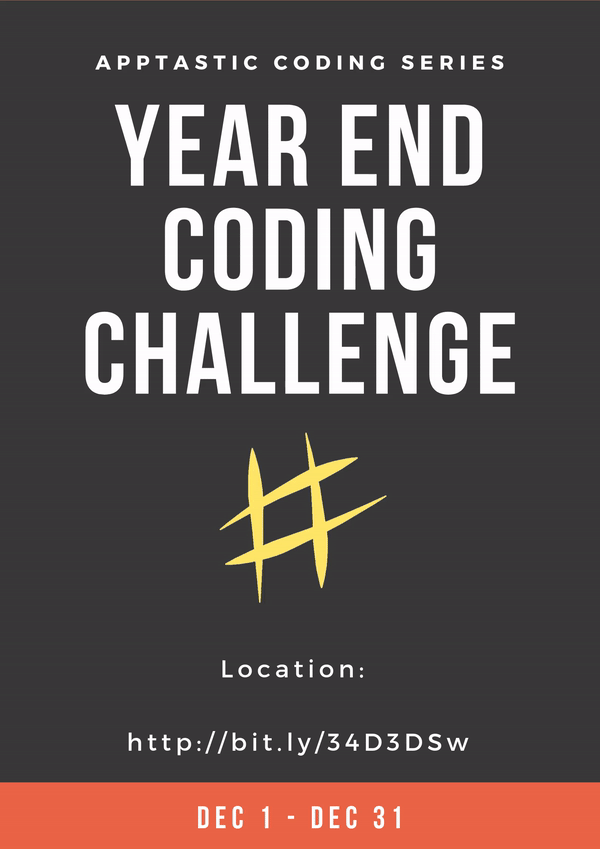

# Dec_2019_CodeChallenge

This repo is dedicated for all the #coders who are participating in the Code Challenge.

#Update:
##Challenge 1: 
NLP + ML [High Difficulty]

Your Input is a 1000 words/prose. Your output should be a array of {Questions + Answers}. Use NLP to generate question from the given prose input. Just think Comprehensive Questioning but in Reverse!

##Challenge 2: 
NLP [Low Difficulty]

Your Input is a sentence/command. Your output should be a response for the sentence/command. You can use any language, library. But my recommendation is to Use Python + Rasa NLP to generate absolutely original chat client/app.

If you want to participate, create a Fork of this repo. Add a new folder with your github username and start coding inside that folder. At the end of the competition period, the winners will be announced.

## Objective:

1) Create simple working solutions on any technology. Can be a standalone app, game or a plugin. 

2) All your contributions  will be taken into consideration for Leaderboard, Brag rights & Prizes.

3) Innovation, Lines of Code contributed and Code style - Judging Categories!

4) Work on your own idea Or if you want to take up more challenge, the challenge statements will be posted here on Dec 1st.

Watch out for more updates.
